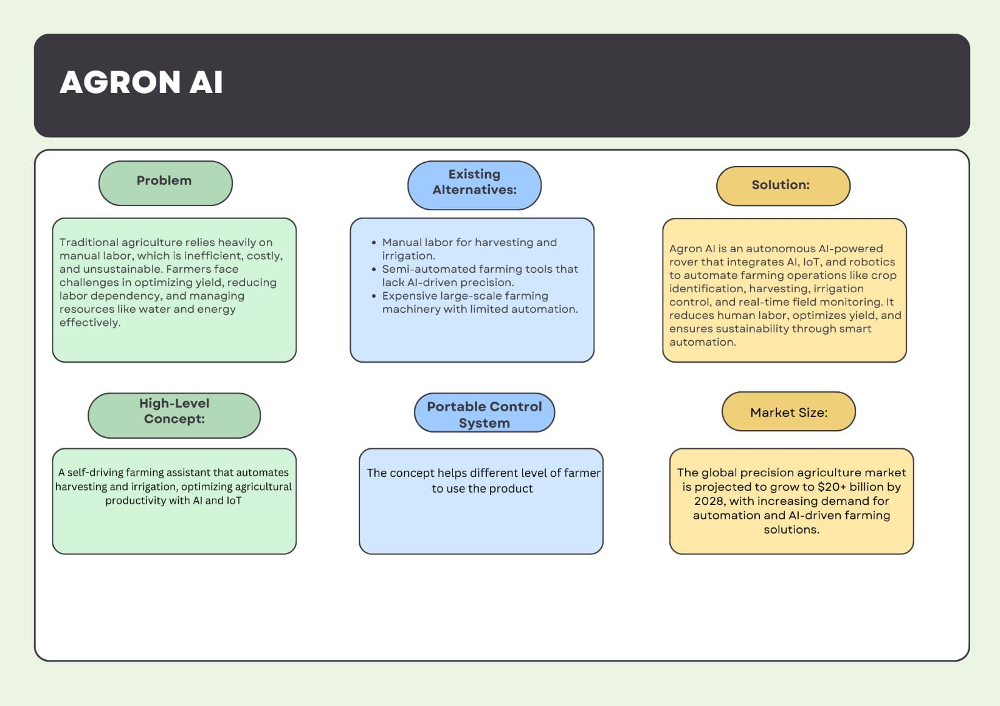
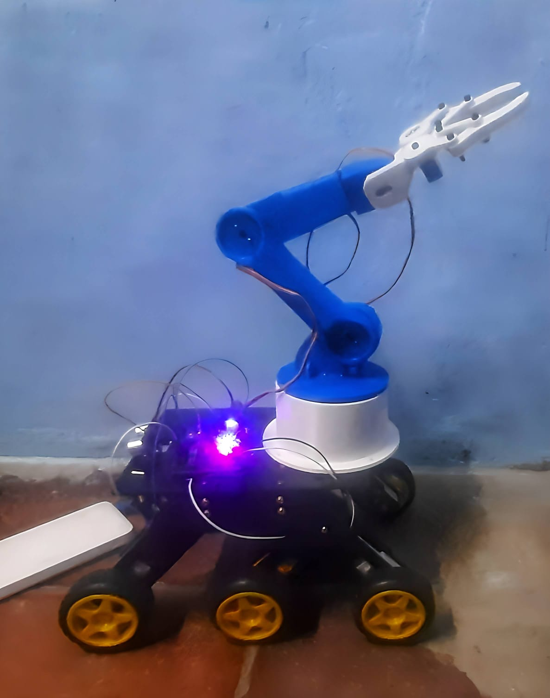
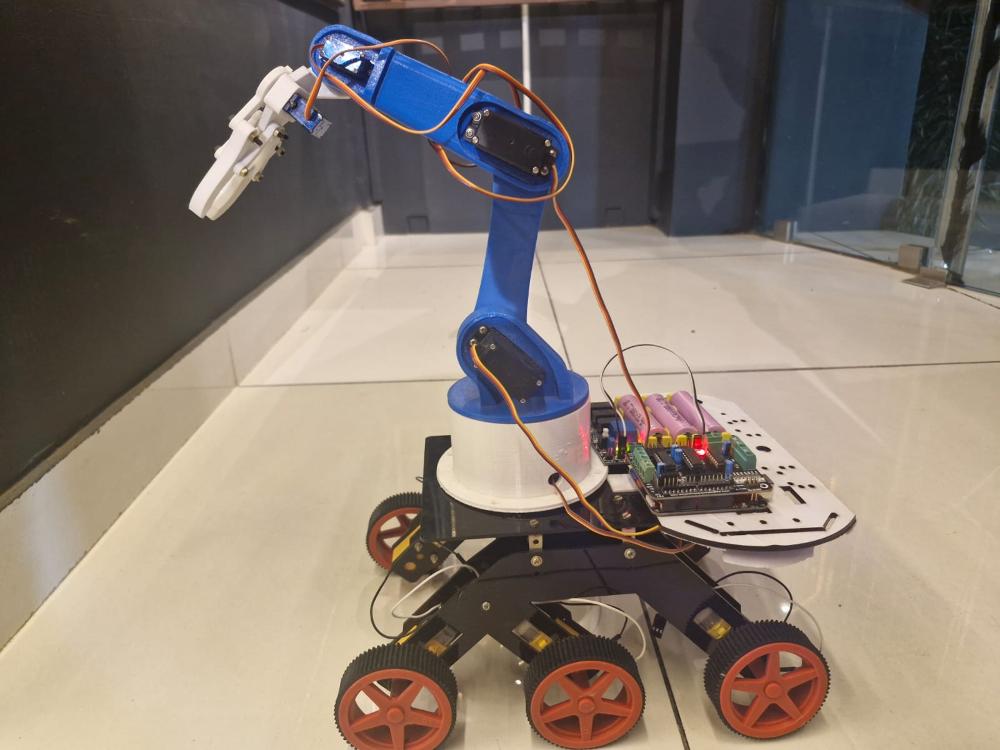

# Agron AI - Autonomous Agricultural Robotics System



> **Note:** This is a prototype project demonstrating the feasibility and potential of AI-powered agricultural automation.

> **Current Status:** The project is currently in development and focuses on tomato ripeness detection as a proof of concept. Future versions will expand to detect and classify all types of fruits and vegetables.

## Abstract

Agron AI is an innovative AI-powered agricultural solution aimed at revolutionizing traditional farming practices by integrating automation, artificial intelligence, and renewable energy technologies. This advanced system is designed to perform essential farming operations, such as crop identification, precision harvesting, automated irrigation, and real-time field monitoring.

**Project Status:** Prototype/Proof of Concept (In Development)
**Current Scope:** Tomato ripeness detection and classification
**Future Scope:** Multi-crop detection for all fruits and vegetables

## Problem Statement

Traditional agriculture faces several critical challenges:
- **Labor Shortage**: Shortage of skilled labor hampers timely and efficient farming operations
- **Resource Wastage**: Inefficient water usage and unpredictable weather patterns
- **Low Productivity**: Reduced crop yields due to lack of real-time data for informed decision-making
- **High Costs**: Manual labor is inefficient, costly, and unsustainable

## Solution

Agron AI is an autonomous AI-powered rover that integrates AI, IoT, and robotics to automate farming operations like:
- Crop identification and precision harvesting
- Automated irrigation control
- Real-time field monitoring
- Resource optimization

The system reduces human labor, optimizes yield, and ensures sustainability through smart automation.

## Key Features

### 1. AI-Powered Precision Harvesting

- Advanced object detection models (CNN, YOLO)
- Tomato ripeness detection (ripe vs unripe classification)
- Selective harvesting without crop damage

**Detection Results:**

<div align="center">
  
  
  
</div>

*Real-time tomato ripeness classification using computer vision*

### 2. Smart Basket Handling System
- Weight-sensitive basket alerts operators when full
- Automatic navigation to drop-off points

### 3. Automated Irrigation Management
- Real-time moisture and weather sensor data
- Optimized water distribution
- Resource conservation

### 4. Renewable Energy Integration
- Solar panel powered operations
- Reduced environmental impact and operational costs

### 5. Remote Monitoring & Control
- Cloud-based mobile interface
- Real-time field updates
- Data-driven decision making

### 6. Scalability & Upgradability
- Designed for small farms to large agricultural fields
- Future upgrade: NVIDIA Jetson Nano integration

## Hardware Components



### Rover System
- **Rover Base**: Mobile platform for autonomous navigation
- **SG90 Servo Motors**: For rover movement and steering
- **L293D Motor Driver**: Motor control and power distribution
- **Ultrasonic Sensor**: Obstacle detection and navigation

### Robotic Arm
- **Robotic Arm**: Precision harvesting mechanism
- **MG996R Servo Motors**: High-torque arm actuation

### Computing & Vision
- **Raspberry Pi**: Main processing unit (upgrade path to NVIDIA Jetson Nano)
- **Raspberry Pi Camera**: Real-time vision and object detection

### Power Management
- **3200mAh Battery**: Main power source
- **TP4056 Micro USB Board**: Battery charging circuit
- **Step-up Converter**: Voltage regulation

### Communication
- **HC-05 Bluetooth Module**: Wireless control and data transmission

## Tech Stack

### Machine Learning & Computer Vision
- **TensorFlow/Keras**: Deep learning framework
- **OpenCV**: Computer vision library
- **YOLO**: Object detection (labels in dataset)
- **CNN Model**: Custom trained model for tomato ripeness detection

### Programming Languages
- **Python**: Primary language for AI/ML and control systems
- **C/C++**: Embedded systems programming

### Hardware Programming
- **Raspberry Pi OS**: Operating system
- **GPIO**: Hardware control
- **Serial Communication**: Bluetooth and sensor interfaces

### Web Technologies
- **HTML5/CSS3**: Web interface design
- **JavaScript**: Frontend interactivity
- **TypeScript/React**: Modern web application framework

### Cloud & IoT
- **Cloud Storage**: Data management
- **IoT Sensors**: Real-time environmental monitoring
- **Mobile App**: Remote control and monitoring

## Project Structure

```
Tomato_Ripeness_detection/
├── dataset/
│   ├── Images/           # Training images (ripe & unripe tomatoes)
│   └── labels/           # YOLO format annotations
├── Images/               # Project documentation images
├── Website design/       # Web interface (sign-up page)
│   └── sample3.html
├── files/
│   ├── Report.pdf       # Detailed project report
│   └── Agron-AI-Revolutionizing-Agriculture-with-Autonomous-Robotics.pptx
├── tensor.py            # Model training script
├── demo1.py             # Real-time detection demo
└── tomato_model.h5      # Trained Keras model
```

## Model Architecture

### Training (tensor.py)
```python
- Input: 224x224x3 RGB images
- Conv2D Layer: 32 filters, 3x3 kernel
- MaxPooling2D: 2x2
- Flatten Layer
- Dense Layer: 1 unit (sigmoid activation)
- Binary Classification: 0=Unripe, 1=Ripe
```

### Inference (demo1.py)
- Real-time webcam feed
- HSV color space filtering for red detection
- Contour detection and bounding boxes
- Model prediction and labeling


## Dataset

- **Format**: YOLO annotation format
- **Classes**:
  - Class 0: Unripe tomatoes
  - Class 1: Ripe tomatoes
- **Annotations**: Normalized bounding boxes (center_x, center_y, width, height)
- **Split**: 80% training, 20% testing

## Installation & Setup

### Prerequisites
```bash
pip install tensorflow opencv-python numpy scikit-learn
```

### Hardware Setup
1. Connect Raspberry Pi Camera to Raspberry Pi
2. Wire HC-05 Bluetooth module
3. Connect motor drivers to servo motors
4. Set up power management (battery + TP4056 + step-up converter)
5. Connect ultrasonic sensor for obstacle detection
6. Mount robotic arm with MG996R servos

### Software Setup
1. Clone the repository
2. Install dependencies
3. Load the trained model: `tomato_model.h5`
4. Run the detection system: `python demo1.py`

## Usage

### Training the Model
```bash
python tensor.py
```

### Running Real-Time Detection
```bash
python demo1.py
```
Press 'q' to quit the detection window.

## Socio-Economic Impact

- **Farmers**: Increased productivity, reduced labor costs, improved resource management
- **Agricultural Enterprises**: Operational efficiency for large-scale farming
- **Research Institutions**: Platform for precision agriculture innovation
- **Environmental**: Renewable energy and resource conservation
- **Government**: Model for sustainable agricultural practices

## Market Opportunity

The global precision agriculture market is projected to grow to **$20+ billion by 2028**, with increasing demand for automation and AI-driven farming solutions.

## Beneficiaries

- Smallholder and large-scale farmers
- Agricultural enterprises
- Research institutions
- Environmental advocates
- Government agencies

## Future Upgrades

### Phase 1 (Current Development)
- ✅ Tomato ripeness detection (Completed - Proof of Concept)
- 🔄 System testing and optimization

### Phase 2 (Planned)
- **Multi-Crop Detection**: Expand from tomatoes to all fruits and vegetables
  - Apples, oranges, strawberries, peppers, cucumbers, eggplants, etc.
  - Universal fruit/vegetable detection model
  - Crop-specific ripeness classification
- **Advanced AI Models**: More sophisticated detection algorithms
- **Disease & Pest Detection**: Identify plant health issues

### Phase 3 (Future)
- **NVIDIA Jetson Nano**: Enhanced AI processing power
- **Predictive Analytics**: Weather and yield forecasting
- **Fleet Management**: Control multiple rovers
- **Commercial Deployment**: Production-ready system

## Team & Contributors

This project was developed by a collaborative team of agricultural robotics innovators at **Francis Xavier Engineering College**:

### Team Members

| Name | Role | GitHub |
|------|------|--------|
| **Siva** | Project Lead, AI/ML Engineer & Software Developer | https://github.com/siva-mariappan |
| **Jai Bharath Kailash** | AI/ML Engineer & Computer Vision Engineer | https://github.com/Jazz2407 |
| **Felix Rajeev Samuel** | Software Developer | [Paste GitHub link here] |
| **Harish** | Robotics Engineer | https://github.com/MHarish07 |
| **Samrat Eswar** | Embedded Systems Engineer | [Paste GitHub link here] |

### Contributions
This project represents a collaborative effort combining expertise in:
- Artificial Intelligence & Machine Learning
- Embedded Systems & Robotics
- Mechanical Engineering
- Agricultural Science
- Full-Stack Development


## System Overview



*The complete Agron AI system integrating computer vision, robotics, and IoT for autonomous tomato harvesting*

## Contact

For more information or collaboration opportunities, please contact:
- **Institution**: Francis Xavier Engineering College
- **Project Team**: Tech Stars

---

**Agron AI** - Revolutionizing Agriculture with Autonomous Robotics
**Francis Xavier Engineering College** | 2025

---


